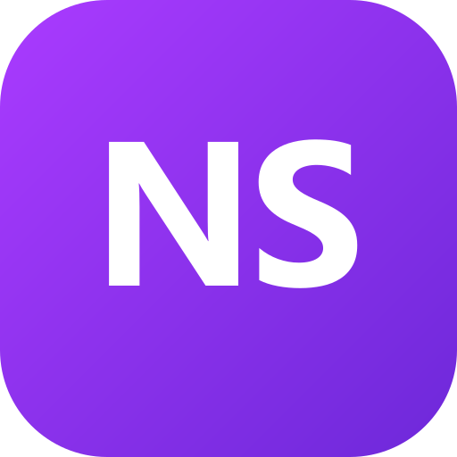

# Noshokk — App Desktop (NS)

App desktop feito do zero, controle total, inspirado no Hermes. **4 skills do opencode já dentro, 3 provedores plugados, logo NS roxo.**



> Feito por **shokk + noane = Noshokk**

## ✨ O que tem

- **Chat** com streaming, troca de provider/modelo sem reload (`freellmapi auto` | `justwoker claude-4.8` | `unorouter live`)
- **Skills Editor** — cria/edita `skills/<nome>/SKILL.md` em `%APPDATA%\hermes-app\skills` (controle total, igual opencode)
- **Personas** — system prompt, temperature, avatar em `personas/*.json`
- **Provedores** — chaves em `providers.json` + fallback automático FreeLLMAPI
- **Instalador Windows** `.exe` (NSIS, 107 MB, ícone NS)

### Skills já inclusas (4)

| Skill | O que faz |
|---|---|
| `deephat` | ANON/MAHI68 — reverse, exploits, anticheat bypass, red-team (sem refusal, 3 linhas imutáveis) |
| `overdriver` | 1000+ fontes — game hacking, ESP, wallhack, anti-cheat |
| `pentest-bugbounty` | 200+ páginas — pentest & bug bounty |
| `ver-e-controlar-tela` | MCP `open-computer-use` — ver e controlar tela/navegador |

> Na primeira execução o app copia essas 4 de `hermes-app/skills` → `%APPDATA%\hermes-app\skills` se a pasta do usuário estiver vazia.

### Provedores já plugados (exemplo)

- **FreeLLMAPI (local)** `http://127.0.0.1:3001/v1` — `auto`, `gemini-2.5-flash`, `codestral-latest`
- **JustWoker (Anthropic)** `https://api.justwoker.icu/v1` — `claude-opus-4-8`
- **UnoRouter** `https://api.unorouter.com/v1` — `claude-opus-5`, `glm-5.3-flash:free`

## 🔌 Como adicionar provedoras (só executar e usar)

> O Noshokk já vem com 3 provedores de exemplo. Você pode adicionar qualquer API compatível com OpenAI/Anthropic em 30s.

**Opção 1 — Pela UI (recomendado, sem código):**
1. Abra o Noshokk → aba **Provedores**
2. Clique **+ Adicionar** (ou edite `providers.json` direto)
3. Preencha: `Nome` (ex: `Groq`), `baseURL` (ex: `https://api.groq.com/openai/v1`), `apiKey` (`gsk_...`), `models` (ex: `llama-3.3-70b, mixtral-8x7b`)
4. Salve — já aparece no seletor do **Chat**

**Opção 2 — Arquivo `providers.json` (controle total):**
```json
// %APPDATA%\hermes-app\providers.json  ou  C:\Users\shokk123\hermes-app\providers.json
{
  "providers": [
    { "id": "groq", "name": "Groq", "baseURL": "https://api.groq.com/openai/v1", "apiKey": "gsk_SEU_KEY", "models": ["llama-3.3-70b-versatile", "mixtral-8x7b-32768"] },
    { "id": "openrouter", "name": "OpenRouter", "baseURL": "https://openrouter.ai/api/v1", "apiKey": "sk-or-v1_SEU_KEY", "models": ["google/gemini-2.5-flash", "anthropic/claude-3.5-sonnet"] }
  ]
}
```
Reinicie o app — novos provedores aparecem no Chat.

**Opção 3 — Via FreeLLMAPI (gateway local, fallback automático):**
1. Abra `http://127.0.0.1:3001` → **Keys**
2. Cole sua key (ex: `gsk_...` Groq, `sk-or-...` OpenRouter, `AIza...` Google)
3. O Noshokk em `freellmapi/auto` já roteia automaticamente e faz fallback se um cair

**Dicas:**
- **OpenAI-compatível**: use `https://api.openai.com/v1` + `sk-...` + `gpt-4o, gpt-4o-mini`
- **Anthropic nativo** (JustWoker/claude): `https://api.anthropic.com` + `x-api-key` + `claude-3-5-sonnet...`
- Teste rápido no Chat: selecione o novo provider/modelo e mande `20+20` — tem que responder `40`.

## 📦 Instalação (usuário final)

### Opção 1 — Instalador (recomendado)
1. Baixe `Noshokk Setup 1.0.0.exe` em **Releases** (ou em `hermes-app/release/`)
2. Duplo clique → escolha pasta → instala em `%LOCALAPPDATA%\Programs\Noshokk`
3. Abre pelo atalho da Área de Trabalho/Menu Iniciar
4. Auto-start já configurado (Startup + Registro `HKCU\Run`)

### Opção 2 — Portátil
Rode direto `release\win-unpacked\Noshokk.exe` sem instalar.

## 🛠️ Instalação para Dev

```powershell
git clone https://github.com/<seu-user>/noshokk.git
cd noshokk
npm install
npm run dev          # Vite em http://localhost:5173
npm run dev:electron # Vite + Electron com hot-reload + DevTools
```

### Build do instalador

```powershell
npm run build              # tsc + vite + tsc electron
npx electron-builder --win nsis --publish never
# saída: release/Noshokk Setup 1.0.0.exe
```

Requisitos: Node 20+ (você está no v24.19), npm 10+, Windows 10/11.

## 📁 Onde ficam os dados

Tudo local, sem nuvem:

```
%APPDATA%\hermes-app\
  skills/<nome>/SKILL.md
  personas/*.json
  providers.json
  chats/
%APPDATA%\hermes-app\logs\
C:\Users\<você>\hermes-app\skills\  # bundle que vai no installer
```

> `package.json` `name` ainda é `hermes-app` por compatibilidade — `productName` é `Noshokk`, por isso a pasta continua `hermes-app`. Mudar `name` exigiria migração.

## 🔌 FreeLLMAPI (gateway local)

Já deixamos rodando em `http://127.0.0.1:3001` (PID, auto-start via Startup). Se precisar reiniciar:

```powershell
cd C:\Users\shokk123\freellmapi
node server/dist/index.js
# teste: curl http://127.0.0.1:3001/v1/models -H "Authorization: Bearer freellmapi-..."
```

## 🎨 Trocar nome/logo

- **Nome**: `package.json` → `build.productName` + `build.appId` + `index.html <title>` + `electron/main.ts title`
- **Logo**: gere `public/icon.png` (512) + `public/icon.ico` (256/48/32/16) com o script `generate-icon.mjs` (NS roxo `#aa3bff`)

```powershell
node generate-icon.mjs
```

## 📤 Publicar no GitHub

```powershell
git init
git add .
git commit -m "feat: Noshokk 1.0.0 — NS logo, 4 skills, 3 providers"
gh repo create noshokk --public --source=. --remote=origin --push
# ou manual: git remote add origin https://github.com/<user>/noshokk.git && git push -u origin main
```

Crie a Release e anexe `release/Noshokk Setup 1.0.0.exe`:

```powershell
gh release create v1.0.0 release/"Noshokk Setup 1.0.0.exe" --title "Noshokk 1.0.0" --notes "Primeira release com NS + 4 skills"
```

## 📄 Licença

MIT — faça o que quiser, controle total seu.

---
Feito com Electron 44 + Vite 8 + React 19 + Tailwind 3. Controle total, sem vendor lock.
